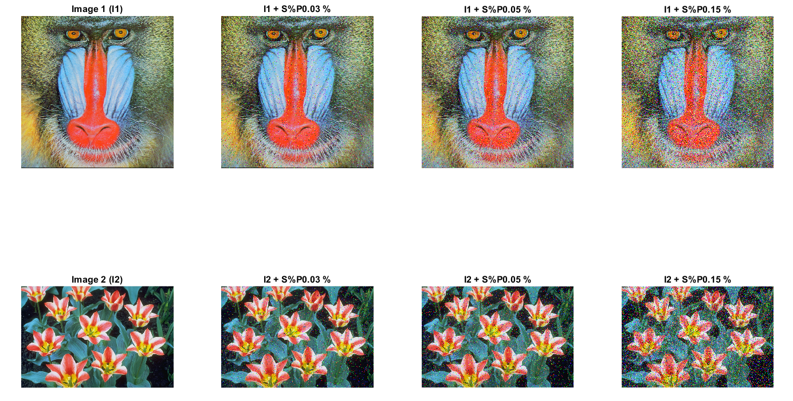
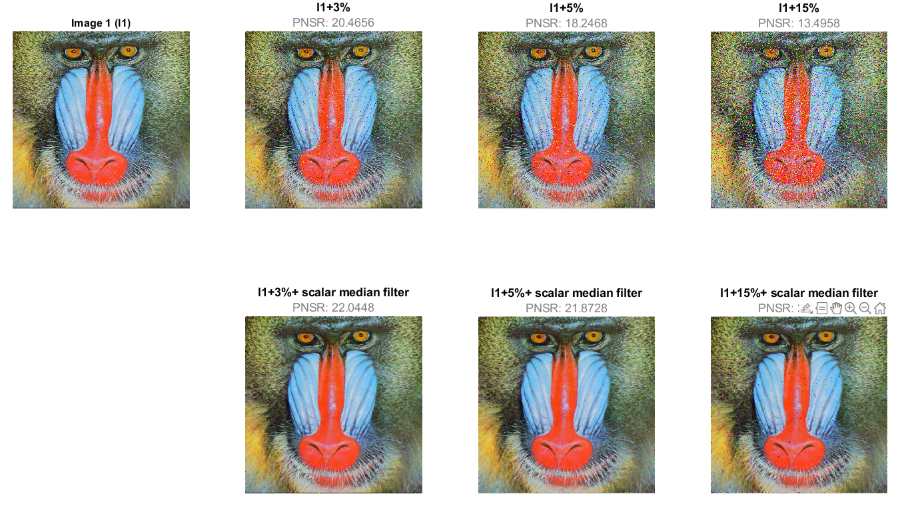
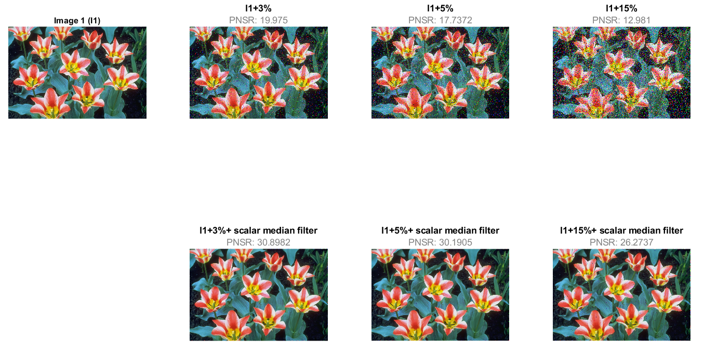
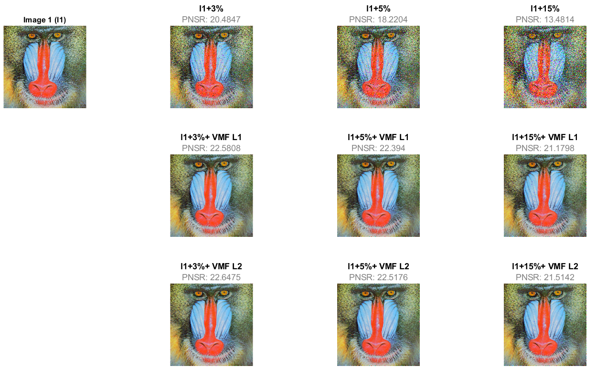
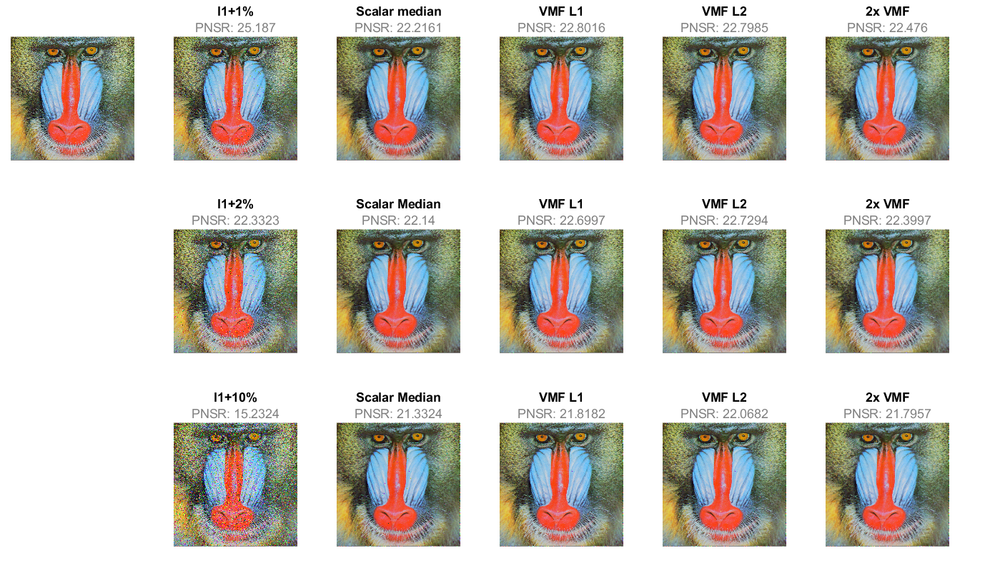

# Color image filtering
## 1a) Image presentation

```matlab
clc
clear all
warning off
img_1 = imread("images/baboon.png");
subplot(2,4,1), imshow(img_1);
title('Image 1 (I1)');

img_2 = imread("images/tulips.png");
subplot(2,4,5), imshow(img_2);
title('Image 2 (I2)');

noise_percentage = [0.03 0.05 0.15];

for i = 1:length(noise_percentage)
    img_noise_1 = imnoise(img_1,"salt & pepper",noise_percentage(i));
    subplot(2,4,i+1), imshow(img_noise_1)
    title(strcat("I1 + S%P",string(noise_percentage(i)), " %"));

    img_noise_2 = imnoise(img_2,"salt & pepper",noise_percentage(i));
    subplot(2,4,i+5), imshow(img_noise_2)
    title(strcat("I2 + S%P",string(noise_percentage(i)), " %"));
end
```



## 1b) Imnoise command – noise level verification

You obtain more noise because it apply the noise to the cannel separately

```matlab
img_gray = rgb2gray(img_1);
img_gray_noise = imnoise(img_gray,'salt & pepper',0.03);
count=0;
for i=1:size(img_gray,1)
    for j=1:size(img_gray,2)
        if img_gray(i,j) ~= img_gray_noise(i,j)
            count = count+1;
        end
    end
end

fprintf('Gray noise percentage: %.2f\n',count/(size(img_gray,1)*size(img_gray,2)))
```

```text:Output
Gray noise percentage: 0.03
```

```matlab

img_rgb_noise = imnoise(img_1,'salt & pepper',0.03);
img_rgb_noise_in_gray = rgb2gray(img_rgb_noise);
for i=1:size(img_gray,1)
    for j=1:size(img_gray,2)
        if img_gray(i,j) ~= img_gray_noise(i,j)
            count = count+1;
        end
    end
end

fprintf('RGB noise percentage: %.2f\n',count/(size(img_gray,1)*size(img_gray,2)))
```

```text:Output
RGB noise percentage: 0.06
```

```matlab:Code

```

## 2a) Scalar RGB median (Marginal Median Filter) 

```matlab
%Image 1
figure
subplot(2,4,1), imshow(img_1);
title('Image 1 (I1)');

noise_percentage = [0.03 0.05 0.15];

for i = 1:length(noise_percentage)

    h = subplot(2,4,i+1);
    img_noise_1 = imnoise(img_1,"salt & pepper",noise_percentage(i));
    imshow(img_noise_1);
    formattedText = {strcat('\fontsize{12}\color{black}\bf','I1+',string(noise_percentage(i)*100),"%"); strcat('\fontsize{12}\color{gray}\rmPNSR:', " ",string(psnr(img_noise_1,img_1)))};
    title(h, formattedText);
    
    h = subplot(2,4,i+5);
    marginal_median_img = marginal_median_filter(img_noise_1,3,3);
    imshow(marginal_median_img);
    formattedText = {strcat('\fontsize{12}\color{black}\bf','I1+',string(noise_percentage(i)*100),"%",'+ scalar median filter'); strcat('\fontsize{12}\color{gray}\rmPNSR:', " ",string(psnr(marginal_median_img,img_1)))};
    title(h, formattedText);
    
end
```



```matlab

%Image 2
figure
subplot(2,4,1), imshow(img_2);
title('Image 1 (I1)');

noise_percentage = [0.03 0.05 0.15];

for i = 1:length(noise_percentage)

    h = subplot(2,4,i+1);
    img_noise_2 = imnoise(img_2,"salt & pepper",noise_percentage(i));
    imshow(img_noise_2);
    formattedText = {strcat('\fontsize{12}\color{black}\bf','I1+',string(noise_percentage(i)*100),"%"); strcat('\fontsize{12}\color{gray}\rmPNSR:', " ",string(psnr(img_noise_2,img_2)))};
    title(h, formattedText);
    
    h = subplot(2,4,i+5);
    marginal_median_img = marginal_median_filter(img_noise_2,3,3);
    imshow(marginal_median_img);
    formattedText = {strcat('\fontsize{12}\color{black}\bf','I1+',string(noise_percentage(i)*100),"%",'+ scalar median filter'); strcat('\fontsize{12}\color{gray}\rmPNSR:', " ",string(psnr(marginal_median_img,img_2)))};
    title(h, formattedText);
    
end
```



  
## 2b) VMF (Vector Median Filter) 

```matlab
figure
subplot(3,4,1), imshow(img_1);
title('Image 1 (I1)');

noise_percentage = [0.03 0.05 0.15];

for i = 1:length(noise_percentage)

    h = subplot(3,4,i+1);
    img_noise_1 = imnoise(img_1,"salt & pepper",noise_percentage(i));
    imshow(img_noise_1);
    formattedText = {strcat('\fontsize{12}\color{black}\bf','I1+',string(noise_percentage(i)*100),"%"); strcat('\fontsize{12}\color{gray}\rmPNSR:', " ",string(psnr(img_noise_1,img_1)))};
    title(h, formattedText);
    
    % L1
    h = subplot(3,4,i+5);
    vector_median_img_1 = vector_median_filter(img_noise_1,3,3,1);
    imshow(vector_median_img_1);
    formattedText = {strcat('\fontsize{12}\color{black}\bf','I1+',string(noise_percentage(i)*100),"%",'+ VMF L1'); strcat('\fontsize{12}\color{gray}\rmPNSR:', " ",string(psnr(vector_median_img_1,img_1)))};
    title(h, formattedText);
    
    % L2
    h = subplot(3,4,i+9);
    vector_median_img_2 = vector_median_filter(img_noise_1,3,3,2);
    imshow(vector_median_img_2);
    formattedText = {strcat('\fontsize{12}\color{black}\bf','I1+',string(noise_percentage(i)*100),"%",'+ VMF L2'); strcat('\fontsize{12}\color{gray}\rmPNSR:', " ",string(psnr(vector_median_img_2,img_1)))};
    title(h, formattedText);
    
end
```



## 3) Comparison of filtering efficiency 

```matlab
figure
subplot(3,6,1), imshow(img_1);

% Noise 1%
h = subplot(3,6,2);
img_noise_1 = imnoise(img_1,"salt & pepper",0.01);
imshow(img_noise_1);
formattedText = {strcat('\fontsize{12}\color{black}\bf','I1+1%'); strcat('\fontsize{12}\color{gray}\rmPNSR:', " ",string(psnr(img_noise_1,img_1)))};
title(h, formattedText);

% Scalar median filter
h = subplot(3,6,3);
marginal_median_img = marginal_median_filter(img_noise_1,3,3);
imshow(marginal_median_img);
formattedText = {strcat('\fontsize{12}\color{black}\bf','Scalar median'); strcat('\fontsize{12}\color{gray}\rmPNSR:', " ",string(psnr(marginal_median_img,img_1)))};
title(h, formattedText);

% L1
h = subplot(3,6,4);
vector_median_img_1 = vector_median_filter(img_noise_1,3,3,1);
imshow(vector_median_img_1);
formattedText = {strcat('\fontsize{12}\color{black}\bf','VMF L1'); strcat('\fontsize{12}\color{gray}\rmPNSR:', " ",string(psnr(vector_median_img_1,img_1)))};
title(h, formattedText);

% L2
h = subplot(3,6,5);
vector_median_img_2 = vector_median_filter(img_noise_1,3,3,2);
imshow(vector_median_img_2);
formattedText = {strcat('\fontsize{12}\color{black}\bf','VMF L2'); strcat('\fontsize{12}\color{gray}\rmPNSR:', " ",string(psnr(vector_median_img_2,img_1)))};
title(h, formattedText);

% 2 x VMF
h = subplot(3,6,6);
vector_median_img_x2 = vector_median_filter(vector_median_img_1,3,3,1);
imshow(vector_median_img_x2);
formattedText = {strcat('\fontsize{12}\color{black}\bf','2x VMF'); strcat('\fontsize{12}\color{gray}\rmPNSR:', " ",string(psnr(vector_median_img_x2,img_1)))};
title(h, formattedText);

% Noise 2%
h = subplot(3,6,8);
img_noise_1 = imnoise(img_1,"salt & pepper",0.02);
imshow(img_noise_1);
formattedText = {strcat('\fontsize{12}\color{black}\bf','I1+2%'); strcat('\fontsize{12}\color{gray}\rmPNSR:', " ",string(psnr(img_noise_1,img_1)))};
title(h, formattedText);

% Scalar median filter
h = subplot(3,6,9);
marginal_median_img = marginal_median_filter(img_noise_1,3,3);
imshow(marginal_median_img);
formattedText = {strcat('\fontsize{12}\color{black}\bf','Scalar Median'); strcat('\fontsize{12}\color{gray}\rmPNSR:', " ",string(psnr(marginal_median_img,img_1)))};
title(h, formattedText);

% L1
h = subplot(3,6,10);
vector_median_img_1 = vector_median_filter(img_noise_1,3,3,1);
imshow(vector_median_img_1);
formattedText = {strcat('\fontsize{12}\color{black}\bf','VMF L1'); strcat('\fontsize{12}\color{gray}\rmPNSR:', " ",string(psnr(vector_median_img_1,img_1)))};
title(h, formattedText);

% L2
h = subplot(3,6,11);
vector_median_img_2 = vector_median_filter(img_noise_1,3,3,2);
imshow(vector_median_img_2);
formattedText = {strcat('\fontsize{12}\color{black}\bf','VMF L2'); strcat('\fontsize{12}\color{gray}\rmPNSR:', " ",string(psnr(vector_median_img_2,img_1)))};
title(h, formattedText);

% 2 x VMF
h = subplot(3,6,12);
vector_median_img_x2 = vector_median_filter(vector_median_img_1,3,3,1);
imshow(vector_median_img_x2);
formattedText = {strcat('\fontsize{12}\color{black}\bf','2x VMF'); strcat('\fontsize{12}\color{gray}\rmPNSR:', " ",string(psnr(vector_median_img_x2,img_1)))};
title(h, formattedText);

% Noise 15%
h = subplot(3,6,14);
img_noise_1 = imnoise(img_1,"salt & pepper",0.1);
imshow(img_noise_1);
formattedText = {strcat('\fontsize{12}\color{black}\bf','I1+10%'); strcat('\fontsize{12}\color{gray}\rmPNSR:', " ",string(psnr(img_noise_1,img_1)))};
title(h, formattedText);

% Scalar median filter
h = subplot(3,6,15);
marginal_median_img = marginal_median_filter(img_noise_1,3,3);
imshow(marginal_median_img);
formattedText = {strcat('\fontsize{12}\color{black}\bf','Scalar Median'); strcat('\fontsize{12}\color{gray}\rmPNSR:', " ",string(psnr(marginal_median_img,img_1)))};
title(h, formattedText);

% L1
h = subplot(3,6,16);
vector_median_img_1 = vector_median_filter(img_noise_1,3,3,1);
imshow(vector_median_img_1);
formattedText = {strcat('\fontsize{12}\color{black}\bf','VMF L1'); strcat('\fontsize{12}\color{gray}\rmPNSR:', " ",string(psnr(vector_median_img_1,img_1)))};
title(h, formattedText);

% L2
h = subplot(3,6,17);
vector_median_img_2 = vector_median_filter(img_noise_1,3,3,2);
imshow(vector_median_img_2);
formattedText = {strcat('\fontsize{12}\color{black}\bf','VMF L2'); strcat('\fontsize{12}\color{gray}\rmPNSR:', " ",string(psnr(vector_median_img_2,img_1)))};
title(h, formattedText);

% 2 x VMF
h = subplot(3,6,18);
vector_median_img_x2 = vector_median_filter(vector_median_img_1,3,3,1);
imshow(vector_median_img_x2);
formattedText = {strcat('\fontsize{12}\color{black}\bf','2x VMF'); strcat('\fontsize{12}\color{gray}\rmPNSR:', " ",string(psnr(vector_median_img_x2,img_1)))};
title(h, formattedText);
```


