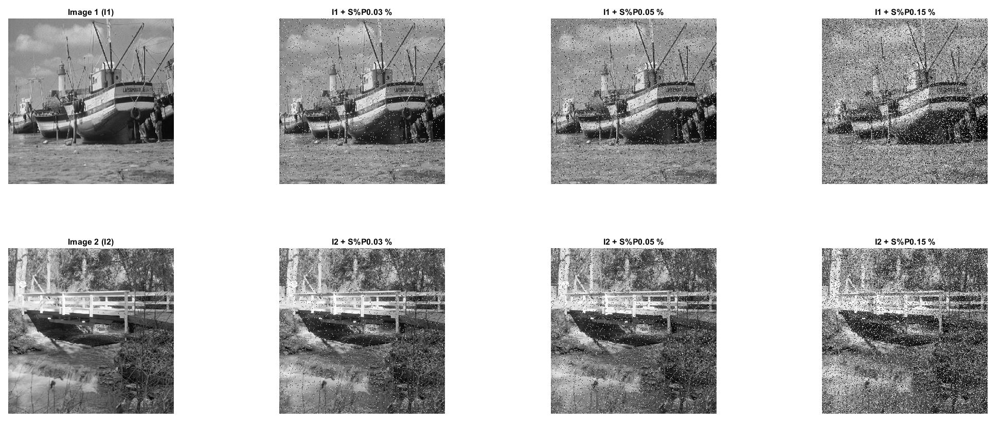
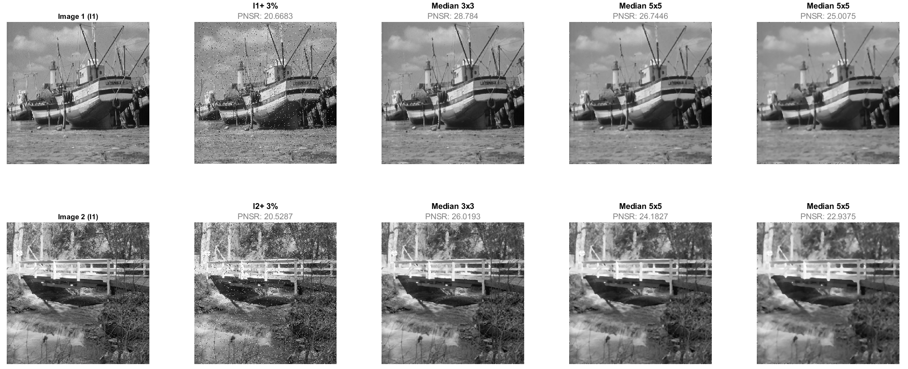
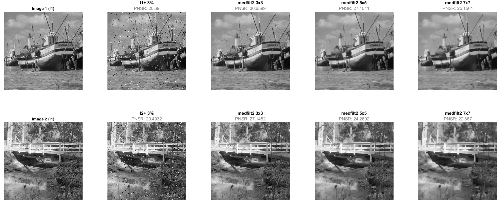
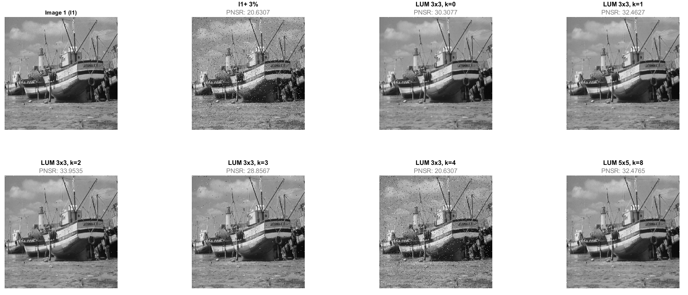

# Non linear filters
## 1) Image presentation

```matlab:Code
clc
clear all
img_1 = imread("images\boat.png");
subplot(2,4,1), imshow(img_1);
title('Image 1 (I1)');

img_2 = rgb2gray(imread("images\walkbridge.png"));
subplot(2,4,5), imshow(img_2);
title('Image 2 (I2)');

noise_percentage = [0.03 0.05 0.15];

for i = 1:length(noise_percentage)
    img_noise_1 = imnoise(img_1,"salt & pepper",noise_percentage(i));
    subplot(2,4,i+1), imshow(img_noise_1)
    title(strcat("I1 + S%P",string(noise_percentage(i)), " %"));

    img_noise_2 = imnoise(img_2,"salt & pepper",noise_percentage(i));
    subplot(2,4,i+5), imshow(img_noise_2)
    title(strcat("I2 + S%P",string(noise_percentage(i)), " %"));
end
```



## 2a) Median filter

```matlab:Code
figure

% First Image
subplot(2,5,1), imshow(img_1);
title('Image 1 (I1)')

img_noise_1 = imnoise(img_1,"salt & pepper",0.03);
h = subplot(2,5,2);
imshow(img_noise_1);
formattedText = {strcat('\fontsize{12}\color{black}\bf','I1+ 3%'); strcat('\fontsize{12}\color{gray}\rmPNSR:', " ",string(psnr(img_noise_1,img_1)))}; 
title(h, formattedText);

median_img_3x3 = median_filter(img_noise_1,3,3);
h = subplot(2,5,3);
imshow(median_img_3x3);
formattedText = {strcat('\fontsize{12}\color{black}\bf','Median 3x3'); strcat('\fontsize{12}\color{gray}\rmPNSR:'," ", string(psnr(median_img_3x3,img_1)))}; 
title(h, formattedText);

median_img_5x5 = median_filter(img_noise_1,5,5);
h = subplot(2,5,4);
imshow(median_img_5x5);
formattedText = {strcat('\fontsize{12}\color{black}\bf','Median 5x5'); strcat('\fontsize{12}\color{gray}\rmPNSR:'," " ,string(psnr(median_img_5x5,img_1)))}; 
title(h, formattedText);

median_img_7x7 = median_filter(img_noise_1,7,7);
h = subplot(2,5,5);
imshow(median_img_7x7);
formattedText = {strcat('\fontsize{12}\color{black}\bf','Median 5x5'); strcat('\fontsize{12}\color{gray}\rmPNSR:'," " ,string(psnr(median_img_7x7,img_1)))}; 
title(h, formattedText);

%Second Image
subplot(2,5,6), imshow(img_2);
title('Image 2 (I1)')

img_noise_2 = imnoise(img_2,"salt & pepper",0.03);
h = subplot(2,5,7);
imshow(img_noise_2);
formattedText = {strcat('\fontsize{12}\color{black}\bf','I2+ 3%'); strcat('\fontsize{12}\color{gray}\rmPNSR:', " ",string(psnr(img_noise_2,img_2)))}; 
title(h, formattedText);

median_img_3x3 = median_filter(img_noise_2,3,3);
h = subplot(2,5,8);
imshow(median_img_3x3);
formattedText = {strcat('\fontsize{12}\color{black}\bf','Median 3x3'); strcat('\fontsize{12}\color{gray}\rmPNSR:'," ", string(psnr(median_img_3x3,img_2)))}; 
title(h, formattedText);

median_img_5x5 = median_filter(img_noise_2,5,5);
h = subplot(2,5,9);
imshow(median_img_5x5);
formattedText = {strcat('\fontsize{12}\color{black}\bf','Median 5x5'); strcat('\fontsize{12}\color{gray}\rmPNSR:'," " ,string(psnr(median_img_5x5,img_2)))}; 
title(h, formattedText);

median_img_7x7 = median_filter(img_noise_2,7,7);
h = subplot(2,5,10);
imshow(median_img_7x7);
formattedText = {strcat('\fontsize{12}\color{black}\bf','Median 5x5'); strcat('\fontsize{12}\color{gray}\rmPNSR:'," " ,string(psnr(median_img_7x7,img_2)))}; 
title(h, formattedText);
```



## 2b) Comparison with Matlab function

```matlab:Code
figure

% First Image
subplot(2,5,1), imshow(img_1);
title('Image 1 (I1)')

img_noise_1 = imnoise(img_1,"salt & pepper",0.03);
h = subplot(2,5,2);
imshow(img_noise_1);
formattedText = {strcat('\fontsize{12}\color{black}\bf','I1+ 3%'); strcat('\fontsize{12}\color{gray}\rmPNSR:', " ",string(psnr(img_noise_1,img_1)))}; 
title(h, formattedText);

median_img_3x3 = medfilt2(img_noise_1,[3 3]);
h = subplot(2,5,3);
imshow(median_img_3x3);
formattedText = {strcat('\fontsize{12}\color{black}\bf','medfilt2 3x3'); strcat('\fontsize{12}\color{gray}\rmPNSR:'," ", string(psnr(median_img_3x3,img_1)))}; 
title(h, formattedText);

median_img_5x5 = medfilt2(img_noise_1,[5 5]);
h = subplot(2,5,4);
imshow(median_img_5x5);
formattedText = {strcat('\fontsize{12}\color{black}\bf','medfilt2 5x5'); strcat('\fontsize{12}\color{gray}\rmPNSR:'," " ,string(psnr(median_img_5x5,img_1)))}; 
title(h, formattedText);

median_img_7x7 = medfilt2(img_noise_1,[7 7]);
h = subplot(2,5,5);
imshow(median_img_7x7);
formattedText = {strcat('\fontsize{12}\color{black}\bf','medfilt2 7x7'); strcat('\fontsize{12}\color{gray}\rmPNSR:'," " ,string(psnr(median_img_7x7,img_1)))}; 
title(h, formattedText);

%Second Image
subplot(2,5,6), imshow(img_2);
title('Image 2 (I1)')

img_noise_2 = imnoise(img_2,"salt & pepper",0.03);
h = subplot(2,5,7);
imshow(img_noise_2);
formattedText = {strcat('\fontsize{12}\color{black}\bf','I2+ 3%'); strcat('\fontsize{12}\color{gray}\rmPNSR:', " ",string(psnr(img_noise_2,img_2)))}; 
title(h, formattedText);

median_img_3x3 = medfilt2(img_noise_2,[3 3]);
h = subplot(2,5,8);
imshow(median_img_3x3);
formattedText = {strcat('\fontsize{12}\color{black}\bf','medfilt2 3x3'); strcat('\fontsize{12}\color{gray}\rmPNSR:'," ", string(psnr(median_img_3x3,img_2)))}; 
title(h, formattedText);

median_img_5x5 = medfilt2(img_noise_2,[5 5]);
h = subplot(2,5,9);
imshow(median_img_5x5);
formattedText = {strcat('\fontsize{12}\color{black}\bf','medfilt2 5x5'); strcat('\fontsize{12}\color{gray}\rmPNSR:'," " ,string(psnr(median_img_5x5,img_2)))}; 
title(h, formattedText);

median_img_7x7 =  medfilt2(img_noise_2,[7 7]);
h = subplot(2,5,10);
imshow(median_img_7x7);
formattedText = {strcat('\fontsize{12}\color{black}\bf','medfilt2 7x7'); strcat('\fontsize{12}\color{gray}\rmPNSR:'," " ,string(psnr(median_img_7x7,img_2)))}; 
title(h, formattedText);
```



## 3) LUM Filter

```matlab:Code
figure
subplot(2,4,1), imshow(img_1);
title('Image 1 (I1)')

img_noise_1 = imnoise(img_1,"salt & pepper",0.03);
h = subplot(2,4,2);
imshow(img_noise_1);
formattedText = {strcat('\fontsize{12}\color{black}\bf','I1+ 3%'); strcat('\fontsize{12}\color{gray}\rmPNSR:', " ",string(psnr(img_noise_1,img_1)))}; 
title(h, formattedText);

LUM_img_3x3_k0 = LUM_filter(img_noise_1,3,3,0);
h = subplot(2,4,3);
imshow(LUM_img_3x3_k0);
formattedText = {strcat('\fontsize{12}\color{black}\bf','LUM 3x3, k=0'); strcat('\fontsize{12}\color{gray}\rmPNSR:'," ", string(psnr(LUM_img_3x3_k0,img_1)))}; 
title(h, formattedText);

LUM_img_3x3_k1 = LUM_filter(img_noise_1,3,3,1);
h = subplot(2,4,4);
imshow(LUM_img_3x3_k1);
formattedText = {strcat('\fontsize{12}\color{black}\bf','LUM 3x3, k=1'); strcat('\fontsize{12}\color{gray}\rmPNSR:'," ", string(psnr(LUM_img_3x3_k1,img_1)))}; 
title(h, formattedText);

LUM_img_3x3_k2 = LUM_filter(img_noise_1,3,3,2);
h = subplot(2,4,5);
imshow(LUM_img_3x3_k2);
formattedText = {strcat('\fontsize{12}\color{black}\bf','LUM 3x3, k=2'); strcat('\fontsize{12}\color{gray}\rmPNSR:'," ", string(psnr(LUM_img_3x3_k2,img_1)))}; 
title(h, formattedText);

LUM_img_3x3_k3 = LUM_filter(img_noise_1,3,3,3);
h = subplot(2,4,6);
imshow(LUM_img_3x3_k3);
formattedText = {strcat('\fontsize{12}\color{black}\bf','LUM 3x3, k=3'); strcat('\fontsize{12}\color{gray}\rmPNSR:'," ", string(psnr(LUM_img_3x3_k3,img_1)))}; 
title(h, formattedText);

LUM_img_3x3_k4 = LUM_filter(img_noise_1,3,3,4);
h = subplot(2,4,7);
imshow(LUM_img_3x3_k4);
formattedText = {strcat('\fontsize{12}\color{black}\bf','LUM 3x3, k=4'); strcat('\fontsize{12}\color{gray}\rmPNSR:'," ", string(psnr(LUM_img_3x3_k4,img_1)))}; 
title(h, formattedText);

LUM_img_5x5_k3 = LUM_filter(img_noise_1,5,5,8);
h = subplot(2,4,8);
imshow(LUM_img_5x5_k3);
formattedText = {strcat('\fontsize{12}\color{black}\bf','LUM 5x5, k=8'); strcat('\fontsize{12}\color{gray}\rmPNSR:'," ", string(psnr(LUM_img_5x5_k3,img_1)))}; 
title(h, formattedText);
```


