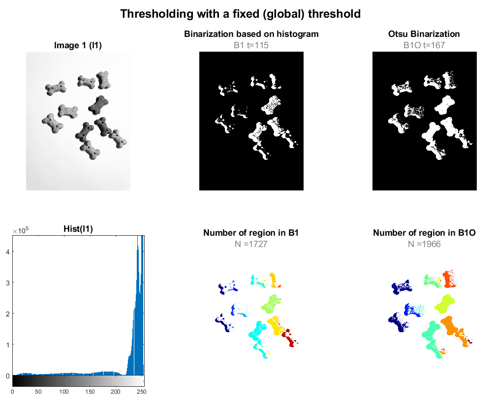
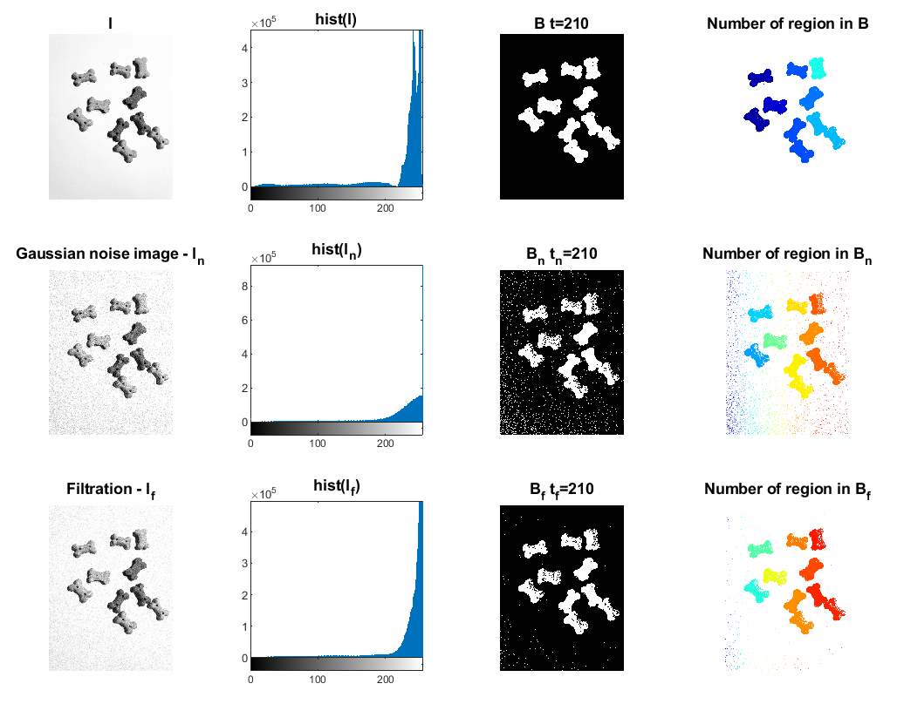
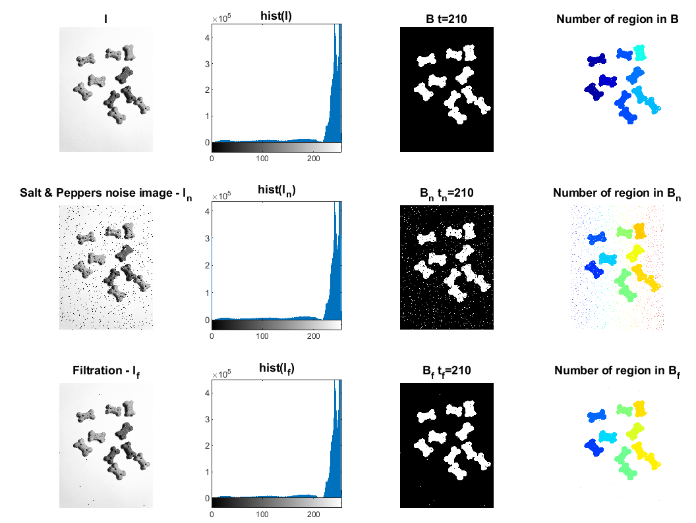
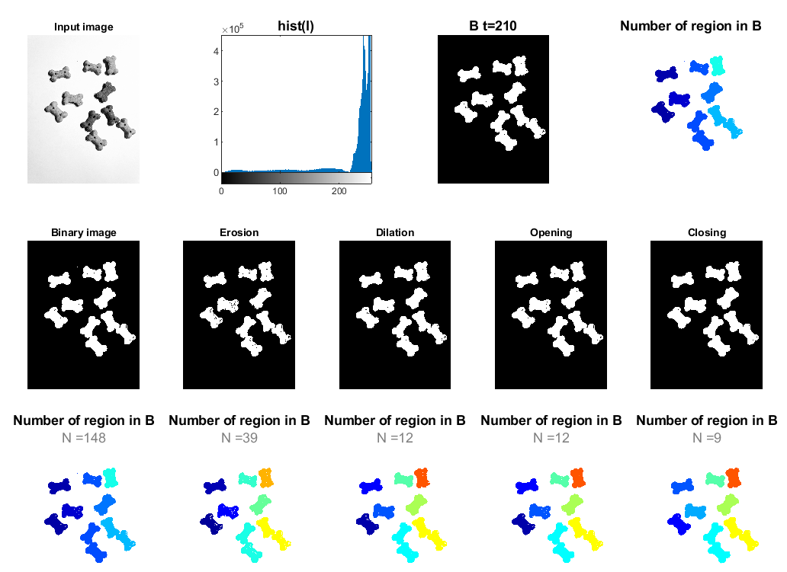

# Image Segmentation
## 1) Thresholding with a fixed (global) threshold

```matlab:Code
clc
clear all
t_s = '\fontsize{12}\color{black}\bf';
ft_s = '\fontsize{16}\color{black}\bf';
s_s = '\fontsize{12}\color{gray}\rm';
img = rgb2gray(imread("images\dog.jpg"));

h = subplot(2,3,1);
imshow(img);
formattedText = {strcat(t_s,'Image 1 (I1)');};
title(h, formattedText);

h = subplot(2,3,4);
imhist(img);
formattedText = {strcat(t_s,'Hist(I1)');};
title(h, formattedText);

h = subplot(2,3,2);
binary_img = img > 115;
binary_img = 1 - binary_img;
imshow(binary_img);
formattedText = {strcat(t_s,'Binarization based on histogram'); strcat(s_s,'B1 t=115') };
title(h, formattedText);

h = subplot(2,3,5);
[labels, N_object] =bwlabel(binary_img);
labels_rgb=label2rgb(labels);
imshow(labels_rgb);
formattedText = {strcat(t_s,'Number of region in B1'); strcat(s_s,'N =',string(N_object))};
title(h, formattedText);

h = subplot(2,3,3);
[binary_img_otsu, threshold] = otsu_method(img);
imshow(binary_img_otsu);
formattedText = {strcat(t_s,'Otsu Binarization'); strcat(s_s,'B1O t=',string(threshold)) };
title(h, formattedText);

h = subplot(2,3,6);
[labels, N_object] =bwlabel(binary_img_otsu);
labels_rgb=label2rgb(labels);
imshow(labels_rgb);
formattedText = {strcat(t_s,'Number of region in B1O'); strcat(s_s,'N =',string(N_object))};
title(h, formattedText);

formattedText = {strcat(ft_s,'Thresholding with a fixed (global) threshold');};
sgtitle(formattedText);
```



```matlab:Code

```

## 2) Effect of preprocessing on binarization 

**2.1) Gaussian Noise**

```matlab:Code
figure
% Original image
h = subplot(3,4,1);
imshow(img);
formattedText = {strcat(t_s,'I');};
title(h, formattedText);

h = subplot(3,4,2);
imhist(img);
formattedText = {strcat(t_s,'hist(I)');};
title(h, formattedText);

h = subplot(3,4,3);
binary_img = img > 210;
binary_img = 1 - binary_img;
imshow(binary_img);
formattedText = {strcat(t_s,'B t=210');};
title(h, formattedText);

h = subplot(3,4,4);
[labels, ~] =bwlabel(binary_img);
labels_rgb=label2rgb(labels);
imshow(labels_rgb);
formattedText = {strcat(t_s,'Number of region in B');};
title(h, formattedText);

% Noise 
h = subplot(3,4,5);
img_noise = imnoise(img,'gaussian',0.05);
imshow(img_noise);
formattedText = {strcat(t_s,'Gaussian noise image - I_n');};
title(h, formattedText);

h = subplot(3,4,6);
imhist(img_noise);
formattedText = {strcat(t_s,'hist(I_n)');};
title(h, formattedText);

h = subplot(3,4,7);
binary_img = img_noise > 210;
binary_img = 1 - binary_img;
imshow(binary_img);
formattedText = {strcat(t_s,'B_n t_n=210');};
title(h, formattedText);

h = subplot(3,4,8);
[labels, ~] =bwlabel(binary_img);
labels_rgb=label2rgb(labels);
imshow(labels_rgb);
formattedText = {strcat(t_s,'Number of region in B_n');};
title(h, formattedText);

%Noise reduction
h = subplot(3,4,9);
img_noise_reduction = gaussian_smoothing_filter(img_noise,3,3,0.53);
imshow(img_noise_reduction);
formattedText = {strcat(t_s,'Filtration - I_f');};
title(h, formattedText);

h = subplot(3,4,10);
imhist(img_noise_reduction);
formattedText = {strcat(t_s,'hist(I_f)');};
title(h, formattedText);

h = subplot(3,4,11);
binary_img = img_noise_reduction > 210;
binary_img = 1 - binary_img;
imshow(binary_img);
formattedText = {strcat(t_s,'B_f t_f=210');};
title(h, formattedText);

h = subplot(3,4,12);
[labels, ~] =bwlabel(binary_img);
labels_rgb=label2rgb(labels);
imshow(labels_rgb);
formattedText = {strcat(t_s,'Number of region in B_f');};
title(h, formattedText);
```



**2.2) Salt \& Pepper noise**

```matlab:Code
figure
% Original image
h = subplot(3,4,1);
imshow(img);
formattedText = {strcat(t_s,'I');};
title(h, formattedText);

h = subplot(3,4,2);
imhist(img);
formattedText = {strcat(t_s,'hist(I)');};
title(h, formattedText);

h = subplot(3,4,3);
binary_img = img > 210;
binary_img = 1 - binary_img;
imshow(binary_img);
formattedText = {strcat(t_s,'B t=210');};
title(h, formattedText);

h = subplot(3,4,4);
[labels, ~] =bwlabel(binary_img);
labels_rgb=label2rgb(labels);
imshow(labels_rgb);
formattedText = {strcat(t_s,'Number of region in B');};
title(h, formattedText);

% Noise 
h = subplot(3,4,5);
img_noise = imnoise(img,'salt & pepper');
imshow(img_noise);
formattedText = {strcat(t_s,'Salt & Peppers noise image - I_n');};
title(h, formattedText);

h = subplot(3,4,6);
imhist(img_noise);
formattedText = {strcat(t_s,'hist(I_n)');};
title(h, formattedText);

h = subplot(3,4,7);
binary_img = img_noise > 210;
binary_img = 1 - binary_img;
imshow(binary_img);
formattedText = {strcat(t_s,'B_n t_n=210');};
title(h, formattedText);

h = subplot(3,4,8);
[labels, ~] =bwlabel(binary_img);
labels_rgb=label2rgb(labels);
imshow(labels_rgb);
formattedText = {strcat(t_s,'Number of region in B_n');};
title(h, formattedText);

%Noise reduction
h = subplot(3,4,9);
img_noise_reduction = LUM_filter(img_noise,3,3,2);
imshow(img_noise_reduction);
formattedText = {strcat(t_s,'Filtration - I_f');};
title(h, formattedText);

h = subplot(3,4,10);
imhist(img_noise_reduction);
formattedText = {strcat(t_s,'hist(I_f)');};
title(h, formattedText);

h = subplot(3,4,11);
binary_img = img_noise_reduction > 210;
binary_img = 1 - binary_img;
imshow(binary_img);
formattedText = {strcat(t_s,'B_f t_f=210');};
title(h, formattedText);

h = subplot(3,4,12);
[labels, ~] =bwlabel(binary_img);
labels_rgb=label2rgb(labels);
imshow(labels_rgb);
formattedText = {strcat(t_s,'Number of region in B_f');};
title(h, formattedText);
```



## 3) Postprocessing - morphological operations 

```matlab:Code
subplot(3,5,1),imshow(img)
title('Input image')

subplot(3,5,6)
binary_img = img > 210;
binary_img = 1 - binary_img;
imshow(binary_img)
title('Binary image')

h = subplot(3,5,11);
[labels, N_object] =bwlabel(binary_img);
labels_rgb=label2rgb(labels);
imshow(labels_rgb);
formattedText = {strcat(t_s,'Number of region in B'); strcat(s_s,'N =',string(N_object))};
title(h, formattedText);

%Erosion
subplot(3,5,7)
binary_img = erosion(binary_img,5,5);
imshow(binary_img);
title('Erosion')

h = subplot(3,5,12);
[labels, N_object] =bwlabel(binary_img);
labels_rgb=label2rgb(labels);
imshow(labels_rgb);
formattedText = {strcat(t_s,'Number of region in B'); strcat(s_s,'N =',string(N_object))};
title(h, formattedText);

% Dilation
subplot(3,5,8)
binary_img = dilation(binary_img,5,5);
imshow(binary_img)
title('Dilation')

h = subplot(3,5,13);
[labels, N_object] =bwlabel(binary_img);
labels_rgb=label2rgb(labels);
imshow(labels_rgb);
formattedText = {strcat(t_s,'Number of region in B'); strcat(s_s,'N =',string(N_object))};
title(h, formattedText);

% Opening
subplot(3,5,9)
for i =1:5
    binary_img = dilation(erosion(binary_img,5,5),5,5);

end
imshow(binary_img);
title('Opening')

h = subplot(3,5,14);
[labels, N_object] =bwlabel(binary_img);
labels_rgb=label2rgb(labels);
imshow(labels_rgb);
formattedText = {strcat(t_s,'Number of region in B'); strcat(s_s,'N =',string(N_object))};
title(h, formattedText);

% Closing
subplot(3,5,10)
binary_img = erosion(dilation(binary_img,7,7),3,3);
imshow(binary_img);
title('Closing')

h = subplot(3,5,15);
[labels, N_object] =bwlabel(binary_img);
labels_rgb=label2rgb(labels);
imshow(labels_rgb);
formattedText = {strcat(t_s,'Number of region in B'); strcat(s_s,'N =',string(N_object))};
title(h, formattedText);
```



