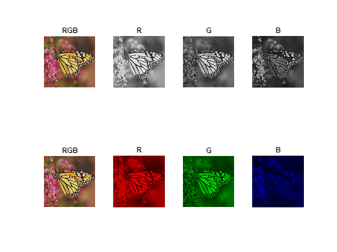
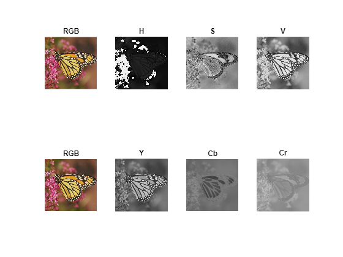
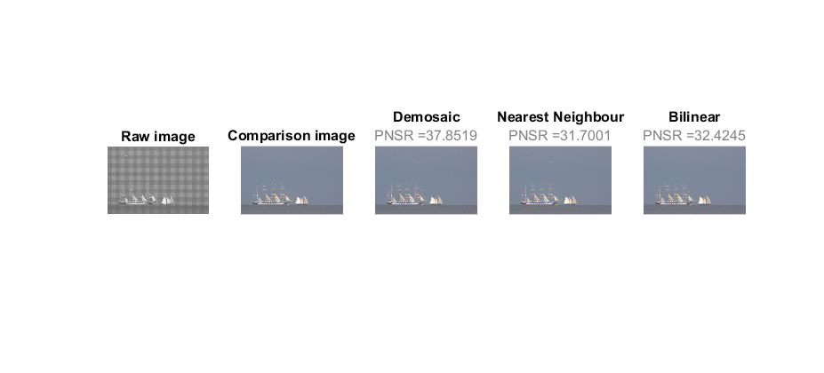

# 1 - Color Image Acquisition
## Table of contents
- [Color spaces](#1.1Colorspaces)
- [Color image acquisition - demosaicing](#1.2Demosaicing)

## 1.1 Color spaces <a name="1.1Colorspaces"></a>

   -  **RGB color space** 

```Matlab
% Text formatting
t_s = '\fontsize{12}\color{black}\bf'; 
s_s = '\fontsize{12}\color{gray}\rm'; 

img_rgb = imread("images/Im_04.bmp");
subplot(2,4,1), imshow(img_rgb); title('RGB')

% Extract color channels.
redChannel = img_rgb(:,:,1); % Red channel
greenChannel = img_rgb(:,:,2); % Green channel
blueChannel = img_rgb(:,:,3); % Blue channel
% Create an all black channel.
allBlack = zeros(size(img_rgb, 1), size(img_rgb, 2), 'uint8');
% Create color versions of the individual color channels.
just_red = cat(3, redChannel, allBlack, allBlack);
just_green = cat(3, allBlack, greenChannel, allBlack);
just_blue = cat(3, allBlack, allBlack, blueChannel);

subplot(2,4,2), imshow(redChannel); title('R')
subplot(2,4,3), imshow(greenChannel); title('G')
subplot(2,4,4), imshow(blueChannel); title('B')

subplot(2,4,5), imshow(img_rgb); title('RGB')
subplot(2,4,6), imshow(just_red); title('R')
subplot(2,4,7), imshow(just_green); title('G')
subplot(2,4,8), imshow(just_blue); title('B')
```



   -  **HSV and YCbCr color spaces** 

It doesn’t make sense to show the image in HSV and YCbCr since they loss visual meaning because: 

In **YCbCr** color space, luminance information is stored as a single component (Y), and chrominance information is stored as two color-difference components (Cb and Cr). Cb represents the difference between the blue component and reference value. Cr represents the difference between the red component and a reference value.

**HSV** is a cylindrical color model that remaps the RGB primary colors into dimensions that are easier for humans to understand. Hue specifies the angle of the color on the RGB color circle, Saturation controls the amount of color used and Value controls the brightness of the color. 

> This is very useful in many applications. In RGB colorspace, the shadow part of an object will most likely have very different characteristics than the  part without shadows. On the other hand, in HSV colorspace, the hue component of both patches of the object is more likely to be similar: the shadow will primarily influence the value, or maybe satuation component, while the hue, indicating the primary "color" should not change so much.**

```Matlab
figure
img_hsv = rgb2hsv(img_rgb);
img_YCrCb = rgb2ycbcr(img_rgb);

% HSV
subplot(2,4,1), imshow(img_rgb); title('RGB')
subplot(2,4,2), imshow(img_hsv(:,:,1)); title('H')
subplot(2,4,3), imshow(img_hsv(:,:,2)); title('S')
subplot(2,4,4), imshow(img_hsv(:,:,3)); title('V')
subplot(2,4,5), imshow(img_rgb); title('RGB')

%YCbCr
subplot(2,4,6), imshow(img_YCrCb(:,:,1)); title('Y')
subplot(2,4,7), imshow(img_YCrCb(:,:,2)); title('Cb')
subplot(2,4,8), imshow(img_YCrCb(:,:,3)); title('Cr')
```



## 1.2 Color image acquisition - demosaicing <a name="1.2Demosaicing"></a>

```Matlab
figure
img = imread("images\IMG_014_srgb_CFA.png");
h = subplot(1,5,1);
imshow(img); formattedText = {strcat(t_s,'Raw image');}; 
title(h, formattedText); 

img_color = imread("images\IMG_014_srgb.png"); 
h = subplot(1,5,2);
imshow(img_color); formattedText = {strcat(t_s,'Comparison image');}; 
title(h, formattedText); 

% Demosaic with Matlab build in function
h = subplot(1,5,3);
imshow(demosaic(img,'bggr')); formattedText = {strcat(t_s,'Demosaic'); strcat(s_s,'PNSR = ',string(psnr(img_color,demosaic(img,'bggr'))))};
title(h, formattedText); 

% Neareast neighbour interpolation
img_NN = nearest_neighbor(img); 
h = subplot(1,5,4);
imshow(img_NN) ; formattedText = {strcat(t_s,'Nearest Neighbour'); strcat(s_s,'PNSR = ',string(psnr(img_color,img_NN)))};
title(h, formattedText); 

% Bilinear interpolation
img_bilinear = bilinear(img); 
h = subplot(1,5,5);
imshow(img_color) ; formattedText = {strcat(t_s,'Bilinear'); strcat(s_s,'PNSR = ',string(psnr(img_color,img_bilinear)))};
title(h, formattedText); 
```



