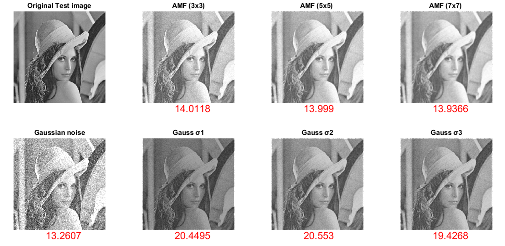
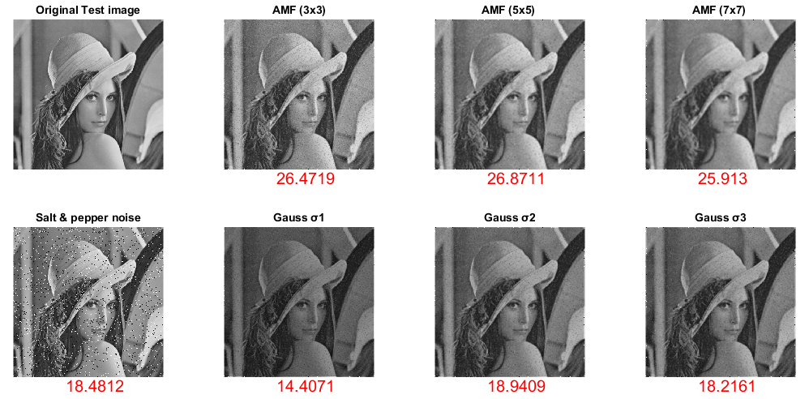
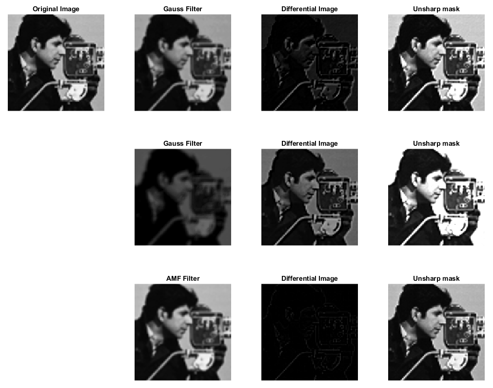
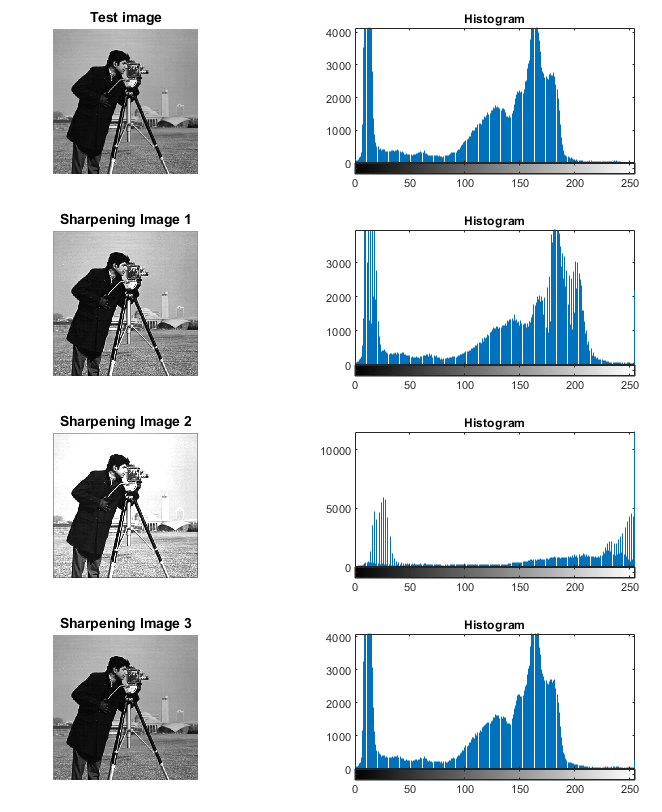

# 2 - Linear filters
## Effect of filtering on noisy images

```matlab:Code
img_lena = imread("images\lena_gray_512.tif");

img_noise_array = imnoise(img_lena,"gaussian",0.2);
img_noise_array(:,:,2) = imnoise(img_lena,"salt & pepper");
str_noise = ["Gaussian noise","Salt & pepper noise"];

noise_type=1;
while (noise_type <= 2)
    figure
    img_noise = img_noise_array(:,:,noise_type);
    subplot(2,4,1), imshow(img_lena);
    title('Original Test image')

    subplot(2,4,5), imshow(img_noise);
    title(str_noise(noise_type))
    text(180,540,string(psnr(img_noise,img_lena)),'FontSize',15,'Color','r');

    Mean_img_3x3 = mean_filter(img_noise,3,3);
    subplot(2,4,2), imshow(Mean_img_3x3)
    title('AMF (3x3)')
    text(180,540,string(psnr(uint8(Mean_img_3x3),img_lena)),'FontSize',15,'Color','r');

    Mean_img_5x5 = mean_filter(img_noise,5,5);
    subplot(2,4,3), imshow(Mean_img_5x5)
    title('AMF (5x5) ')
    text(180,540,string(psnr(uint8(Mean_img_5x5),img_lena)),'FontSize',15,'Color','r');

    Mean_img_5x5 = mean_filter(img_noise,7,7);
    subplot(2,4,4), imshow(Mean_img_5x5)
    title('AMF (7x7) ')
    text(180,540,string(psnr(uint8(Mean_img_5x5),img_lena)),'FontSize',15,'Color','r');

    Gauss_1 = gaussian_smoothing_filter(img_noise,3,3,1.2);
    subplot(2,4,6), imshow(Gauss_1)
    title('Gauss σ1')
    text(180,540,string(psnr(uint8(Gauss_1),img_lena)),'FontSize',15,'Color','r');

    Gauss_2 = gaussian_smoothing_filter(img_noise,5,5,1.2);
    subplot(2,4,7), imshow(Gauss_2)
    title('Gauss σ2')
    text(180,540,string(psnr(uint8(Gauss_2),img_lena)),'FontSize',15,'Color','r');

    Gauss_3 = gaussian_smoothing_filter(img_noise,7,7,1.2);
    subplot(2,4,8), imshow(Gauss_3)
    title('Gauss σ3')
    text(180,540,string(psnr(uint8(Gauss_3),img_lena)),'FontSize',15,'Color','r');

    noise_type = noise_type +1;
end
```





## Unsharp masking

```matlab:Code
figure
img_cameraman = imread("images\cameraman.tif");
subplot(3,4,1), imshow(img_cameraman(80:220,180:320)); title('Original Image')

%Gaussian 
img_gauss = gaussian_smoothing_filter(img_cameraman,5,5,1); subplot(3,4,2),imshow(img_gauss(80:220,180:320)); title('Gauss Filter')

%Differential Image
img_diff = img_cameraman - img_gauss; subplot(3,4,3), imshow(img_diff(80:220,180:320)); title('Differential Image')

%Sharpening using unsharp mask
img_unsharp_1 = img_diff + img_cameraman; subplot(3,4,4), imshow(img_unsharp_1(80:220,180:320)); title('Unsharp mask')

%Gaussian 
img_gauss = gaussian_smoothing_filter(img_cameraman,7,7,3); subplot(3,4,6),imshow(img_gauss(80:220,180:320)); title('Gauss Filter')

%Differential Image
img_diff = img_cameraman - img_gauss; subplot(3,4,7), imshow(img_diff(80:220,180:320)); title('Differential Image')

%Sharpening using unsharp mask
img_unsharp_2 = img_diff + img_cameraman; subplot(3,4,8), imshow(img_unsharp_2(80:220,180:320)); title('Unsharp mask')

%AMF
amf_img = mean_filter(img_cameraman,3,3); subplot(3,4,10), imshow(amf_img(80:220,180:320)); title('AMF Filter')

%Differential Image
img_diff = img_cameraman - amf_img; subplot(3,4,11), imshow(img_diff(80:220,180:320)); title('Differential Image')

%Sharpening using unsharp mask
img_unsharp_3 = img_diff + img_cameraman; subplot(3,4,12), imshow(img_unsharp_3(80:220,180:320)); title('Unsharp mask')
```



```matlab:Code

% Histogram evaluation
figure
subplot(4,2,1), imshow(img_cameraman); title('Test image')
subplot(4,2,2), imhist(img_cameraman); title('Histogram')
subplot(4,2,3), imshow(img_unsharp_1); title('Sharpening Image 1')
subplot(4,2,4), imhist(img_unsharp_1); title('Histogram')
subplot(4,2,5), imshow(img_unsharp_2); title('Sharpening Image 2')
subplot(4,2,6), imhist(img_unsharp_2); title('Histogram')
subplot(4,2,7), imshow(img_unsharp_3); title('Sharpening Image 3')
subplot(4,2,8), imhist(img_unsharp_3); title('Histogram')
```



## Sharpening with Laplacian filter

```matlab:Code
figure
img_cameraman = imread("cameraman.tif"); subplot(3,3,1), imshow(img_cameraman(80:220,180:320)); title('Input Image')

% Laplacian 1
laplacian_1 =[0 1 0;1 -4 1;0 1 0];laplacian_img_1 = linear_filter(img_cameraman ,laplacian_1);
subplot(3,3,2), imshow(laplacian_img_1(80:220,180:320)); title('Laplacian Filter')
sharpened_image_1 = img_cameraman - laplacian_img_1;
subplot(3,3,3), imshow(sharpened_image_1(80:220,180:320)); title('Sharpened Image')

%Laplacian 2
laplacian_2 =[1 1 1;1 -8 1;1 1 1]; laplacian_img_2 = linear_filter(img_cameraman ,laplacian_2);
subplot(3,3,5), imshow(laplacian_img_2(80:220,180:320)); title('Laplacian Filter')
sharpened_image_2 = img_cameraman - laplacian_img_2;
subplot(3,3,6), imshow(sharpened_image_2(80:220,180:320)); title('Sharpened Image')

% Laplacian 3
laplacian_3 =[-1 2 -1;2 -4 2;-1 2 -1]; laplacian_img_3 = linear_filter(img_cameraman ,laplacian_3);
subplot(3,3,8), imshow(laplacian_img_3(80:220,180:320)); title('Laplacian Filter')
sharpened_image_3 = img_cameraman - laplacian_img_3;
subplot(3,3,9), imshow(sharpened_image_3(80:220,180:320)); title('Sharpened Image')
```


```matlab:Code

% Sharpness evaluation
figure
subplot(4,2,1), imshow(img_cameraman); title('Test image')
subplot(4,2,2), imshow(img_cameraman(80:220,180:320)); title('Zoom of test image');
text(30,150,string(estimate_sharpness(img_cameraman)),'FontSize',15,'Color','r');

subplot(4,2,3), imshow(sharpened_image_1); title('Sharpening Image 1')
subplot(4,2,4), imshow(sharpened_image_1(80:220,180:320)); title('Zoom of Sharpening Image 1')
text(30,150,string(estimate_sharpness(sharpened_image_1)),'FontSize',15,'Color','r');

subplot(4,2,5), imshow(sharpened_image_2); title('Sharpening Image 2')
subplot(4,2,6), imshow(sharpened_image_2(80:220,180:320)); title('Zoom of Sharpening Image 2')
text(30,150,string(estimate_sharpness(sharpened_image_2)),'FontSize',15,'Color','r');

subplot(4,2,7), imshow(sharpened_image_3); title('Sharpening Image 3')
subplot(4,2,8), imshow(sharpened_image_3(80:220,180:320));title('Zoom of Sharpening Image 3')
text(30,150,string(estimate_sharpness(sharpened_image_3)),'FontSize',15,'Color','r');
```


```matlab:Code

```

***
*Generated from linear_filters.mlx with [Live Script to Markdown Converter](https://github.com/roslovets/Live-Script-to-Markdown-Converter)*
